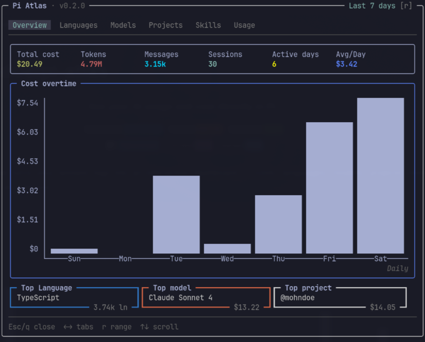

# @mohndoe/pi-atlas

<p align="center">
  <strong>See your AI usage and cost directly in Pi.</strong>
</p>
<p align="center">
  
  <a href="https://www.npmjs.com/package/@mohndoe/pi-atlas"></a>
  
  <br/>
  
  
  <a href="https://github.com/mohndoe/pi-atlas/blob/main/LICENSE"></a>
</p>

A [pi](https://pi.dev) extension that turns your session logs into an interactive dashboard — costs, languages, models, projects, tools, and token usage at a glance.

<p align="center">
 
</p>

---

## Features

- **Multiple time ranges** — Today, Last 7 days, Last 30 days, or All time
- **Cost tracking** — per-model, per-project, based on real usage costs
- **Language breakdown** — lines written and edited
- **Model analytics** — provider-aware model cost, call count. Models are keyed by provider+model combination (same model on different providers tracked separately). Works with local LLMs too.
- **Project attribution** — cost and session count per project directory
- **Usage overview** — tool call frequency and token breakdown (input, output, cache read/write)
- **Cache** — SHA-256-gated persists session aggregates; near-instant open on next visits
- **Lightweight** — only two dependencies: [`chalk`](https://github.com/chalk/chalk) for color output and [`@mohndoe/pi-tui-extras`](https://github.com/MohnDoe/pi-tui-extras) for TUI components

## Dashboard

### Tabs

- **Overview** — Cards displaying total cost, sessions count, messages count, active days, average cost per day, total tokens. A bar chart displaying cost overtime. And top language, top model, and top project side by side.
- **Languages** — Languages ranked by line written.
- **Models** — Models ranked by cost. Shows providers, calls and cost per model.
- **Projects** — Projects ranked by cost. Shows session count and cost per project.
- **Skills** — Skills ranked by cost with invocation count, session count, and token breakdown (total, input, output).
- **Usage** — Token breakdown (Total, Input, Output, Cache Read, Cache Write) and table of tool usage.

All tabs display data corresponding to the selected time range (press `r` to change it). Press `←`/`→` to switch tabs, `↑`/`↓` to scroll table rows.

## Install

```bash
pi install npm:@mohndoe/pi-atlas
```

Then run `/reload` in pi (or restart pi). The `/atlas` command is now available.

## Usage

In the pi terminal, type `/atlas` to open the atlas dashboard. Session data is loaded from `~/.pi/agent/sessions/` -- on first load this may take a moment while JSONL files are parsed. Subsequent opens use a cached snapshot and load instantly.

## How it works

```
~/.pi/agent/sessions/*.jsonl
         │
         ▼ parseFile()        ◄── entry types handled
  ┌──────────────────┐
  │  SessionAgg[]     │   per session, cached to disk
  └────────┬─────────┘
           │
           ▼ summarize(sessions, range)
  ┌──────────────────┐
  │ StatsSummary × 4  │   1d, 7d, 30d, All pre-computed
  └────────┬─────────┘
           │
           ▼
  Tab receives StatsSummary  ──→  Component render
```

**Data sources** — pi stores every session as a `.jsonl` file in `~/.pi/agent/sessions/`. Pi Atlas parses entry types: session headers, user messages, assistant messages, tool results, model changes, thinking level changes, compactions, and branch summaries.

**Caching** — On first open, the sessions directory is scanned and all JSONL files are parsed into `SessionAgg` objects. This aggregate is cached to disk alongside a SHA-256 signature of the directory (file paths, sizes, modification times) and the package version. On subsequent opens, the cache is reused if both the signature and version match, making the dashboard appear instantly.

**Language detection** — Lines are counted by splitting written/edited content on `\n`. File extensions map to language names via a built-in mapping of 70+ extensions (TypeScript, Python, Rust, Go, etc.).

**Cost attribution** — Assistant message costs are attributed to all active projects in the session. See [ADR-0001](./docs/adr/0001-global-session-project-map.md) for details.

## Development

```bash
# Setup
git clone https://github.com/MohnDoe/pi-atlas.git
cd pi-atlas
bun install

# Type check
bun run typecheck

# Test
bun test

# Coverage
bun test --coverage
```

### Architecture decisions

See [docs/adr/](./docs/adr/) for recorded decisions:

- [ADR-0001: Global session-project map](./docs/adr/0001-global-session-project-map.md) — cost attribution model
- [ADR-0002: Pre-computed summaries](./docs/adr/0002-precomputed-summaries.md) — all four time ranges computed at open

A higher-level [ARCHITECTURE.md](./docs/ARCHITECTURE.md) covers module structure and component hierarchy.

## Data privacy

Pi Atlas reads session logs from `~/.pi/agent/sessions/`. All processing is done locally - no data ever leaves your machine. The cache file is written to `~/.pi/pi-atlas-cache.json` and contains aggregated statistics (costs and counts), not message content.

## License

[MIT](./LICENSE)
